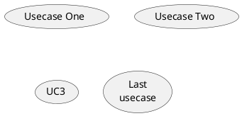

# PlantUML

PlantUML 是一个快速创建 UML 图形的组件，官网上之所以称它是一个组件，我 想主要是因为多数情况下我们都是在 Eclipse、NetBenas、Intellijidea、 Emacs、Word 等软件里来使用 PlantUML。


PlantUML 支持的图形有：Sequence Diagram, Use case Diagram, Class Diagram, Activity Diagram (here is the new syntax), Component Diagram, State Diagram, Object Diagram, Wireframe Graphical Interface。PlantUML 通过简单和直观的语言来定义图形，它可以生成 PNG、SVG 和二进制图片。

```puml
Alice -> Bob: synchronous call
Alice ->> Bob: asynchronous call
```

# 顺序图（Sequence Diagram）

顺序图用 -> , -->, <-, <-- 来绘制参与者（Participants）之 间的消息（Message）。

```puml
Alice -> Bob: Authentication Request
Bob --> Alice: Authentication Response

Alice -> Bob: Another atuhentication Request
Alice <-- Bob: Another authentication Response
```

注释语句以单引号开始头行，即是一个单行注释。多行注释可以使用"'"表示注释内容的开始，然后使用"'"来表示注释内容的结束。

## 参与者

可以使用 participant 关键词来申明参与者，也可以使用下面的参与者分类关键词来申明参与者：actor、boundary、control、entity、database：

```puml
actor Foo1
boundary Foo2
control Foo3
entity Foo4
database Foo5

Foo1 -> Foo2 : To boundary
Foo1 -> Foo3 : To control
Foo1 -> Foo4 : To entity
Foo1 -> Foo5 : To database
```

使用 as 关键词可以为参与者起一个别名，这样在对引用长名的参与者时会方便很多。在参与者申明语句后行尾可以追加背景色的设置，只要把标准的 HTML 颜色值写在后面就行了。

```puml
actor Bob #red
' The only defference between actor
' and participant is the drawing
participant Alice
participant "I have a really\nlong name" as L #99ff99

/' You can also declare:
    participant L as "I have a really\nlong name" #99ff99
'/

Alice -> Bob: Authentication Request
Bob -> Alice: Authentication Response
Bob -> L: Log transaction
```

一个参与者可以给自己发送消息，消息名如果需要有多行文本，可以用 \n 来表示换行。

```puml
Alice -> Alice: This is a signal to self.\nIt also demonstrates\nmultiline \ntext
```

## 消息与箭头

我们也改变箭头的样式（Change arrow style）
在用例图里可以通过以下方式来改变箭头的样式：

- 使用 \ 或 / 来替换 < 或 > 可以让箭头只显示上半部分或下半部分。
- 重复输入箭头或斜杠（ >> // ），用来绘制空心箭头。
- 使用双横线 -- 替代 - 可以用来绘制点线。
- 在箭头后面加个 o 可以在箭头前绘制一个圆圈。
- 使用 <-> 可用来绘制双向箭头。

```puml
Bob -> Alice
Bob ->> Alice
Bob -\ Alice
Bob \\- Alice
Bob //-- Alice

Bob ->o Alice
Bob o\\-- Alice

Bob <-> Alice
Bob <<-\\o Alice
```

我们要改变箭头的颜色，可以使用 HTML 颜色符号，参看下面的例子：

```puml
Bob -[#red]> Alice : hello
Alice -[#0000FF]->Bob : ok
```

消息序号（Message sequence numbering），关键词 autonumber 用来给自动的给消息添加上序号。

```puml
autonumber
Bob -> Alice : Authentication Request
Bob <- Alice : Authentication Response
```

如果需要指定一个起始号码，可以直接在 autonumber 后面加个数字就行 了，如果要设置自增量，再在后面加一个数字就行了（ autonumber start increment）。

```puml
autonumber
Bob -> Alice : Authentication Request
Bob <- Alice : Authentication Response

autonumber 15
Bob -> Alice : Another authentication Request
Bob <- Alice : Another authentication Response

autonumber 40 10
Bob -> Alice : Yet another authentication Request
Bob <- Alice : Yet another authentication Response
```

我们可能经常会在消息的左边或右边使用注解，要添加注解，只要使用 note left 或 note right 关键词就可以了。

```puml
Alice -> Bob : hello
note left: this is a first note

Bob -> Alice : ok
note right: this is anther note

Bob -> Bob : I am thinking
note left
    a note
    can also be defined
    on several lines
end note
```

通过使用关键词 note left of ， note right of 或 note over ， 我们还可以把注解放置在与之相关的参与者的左边或右边，或下方。通过改变注解的背景色，我们还可以高亮一个注解文本块。如果要使用多行注解，可以使用关键词 end note 来表示注解的结束。

```puml
participant Alice
participant Bob
note left of Alice #aqua
    This is displayed
    left of Alice.
end note

note right of Alice: This is displayed right of Alice.

note over Alice: This displayed over Alice.

note over Alice, Bob #FFAAAA: This is displayed\n over Bob and Alice.

note over Bob, Alice
    This is yet another
    example of
    a long note.
end note
```

## 其他修饰

标题（Title）要给图形加一个标题可以用 title 关键词来设置。

```puml
title Simple Comunication example

Alice -> Bob : Authentication Request
Bob --> Alice : Authentication Response
```

使用 legend 和 end legend 关键词可以设置图形的图例。图例可以设 为左对齐、右对齐和居中对齐。

```puml
Alice -> Bob : Hello
legend right
Short
legend
endlegend
```

## 图形分割与分组

关键词 newpage 是用来把图形分割成几个图片的。每一个被分割出来的 图片可以看作是一个新的页面（new page），如果要给新的页面添加一个标题，可以紧跟在关键词 newpage 之后来设置。使用这个方法可以方便的在 Word 里把比较长的图形分别打印到几个不同的页面上（有点分页符的概念）。

```puml
Bliss -> Tia : I love you
Bliss -> Tia : I miss you

newpage

Bliss -> Tia : Let's go home
Bliss -> Tia : Quick

newpage A title for the\nlast page

Tia -> Bliss : Give me money
Tia -> Bliss : No money No love
```

有时候可能需要对消息进行分组，那么可以使用下面的关键词来实现：alt/else、opt、loop、par、break、critical、group, 这个关键词后面的文字会作为组名显示在图形上。上面的关键词后可以添加一些文本用来显示在头部（注：group 除外，因 为它后面的文本用来显示在组名称的位置）。在组嵌套组的结构里可以用关 键词 end 来关闭组或者说是表示一个组符号的结束符（类似 if/endif）。

```puml
Alice -> Bob: Authentication Request

alt successful case
Bob -> Alice: Authentication Accepted
else some kind of failure
Bob -> Alice: Atuhentication Failue
group My own label
    Alice -> Log : Log attack start
    loop 1000 times
    Alice -> Bob: DNS Attack
    end
    Alice -> Log : Loag alice end
end
else Another type of failue
Bob -> Alice: Please repeat
end
```

# 用例图

用例可以用一对小括号括起来表示，也可以使用 usecase 关键词来定义；用例也可以通过使用 as 关键词来设置别名，在建立关系的时候可以使用别名。



定义参与者时，可以把参与者的名称放在两个冒号的中间，也可以用 actor 关键词来定义参与者。同样参与着也可以使用别名。

```puml
:Actor 1:
:Another\nactor: as Men2
actor Men3
actor :Last actor: as Men4
```

```puml
left to right direction
skinparam packageStyle rect
actor customer
actor clerk
rectangle checkout {
customer -- (checkout)
(checkout) .> (payment) : include
(help) .> (checkout) : extends
(checkout) -- clerk
}
```

# 活动图（Activity Diagram）

```puml
!includeurl https://raw.githubusercontent.com/RicardoNiepel/C4-PlantUML/release/1-0/C4_Container.puml

start
:ClickServlet.handleRequest();
:new page;
if (Page.onSecurityCheck) then (true)
:(Page.onInit();
if (isForward?) then (no)
    :Process controls;
    if (continue processing?) then (no)
    stop
    endif

    if (isPost?) then (yes)
    :Page.onPost();
    else (no)
    :Page.onGet();
    endif
    :Page.onRender();
endif
else (false)
endif

if (do redirect?) then (yes)
:redirect process;
else
if (do forward?) then (yes)
    :Forward request;
else (no)
    :Render page template;
endif
endif

stop
```
